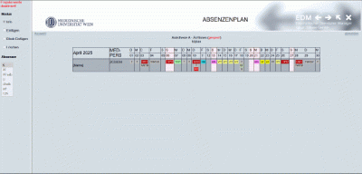

#AKH-Dienst-plugin 🕰️ RetroSite Refresher

> Bringing the 90s meduniwien web into the 2020s — one frameset at a time.

## ✨ What is AKH-Dienst-plugin?

AKH-Dienst-plugin is a Chrome/Firefox-compatible browser extension that takes your old, crusty, frameset-loving website and gives it a fresh, modern look. Think of it as a facelift for legacy sites — no more endless nested scrollbars or hunting through tiny frame windows.

And it doesn’t stop at a glow-up. We added a bunch of features to make your experience *actually* usable again.

---

## 🧠 Features

- 📆 **Month-to-month calendar navigation**: Glide through your shift calendar with slick, user-friendly arrows.
- 📤 **Export your shifts**:
  - To your **Google Calendar** with one click.
  - Or download as a **.CSV file** for spreadsheets, reports, or sharing with coworkers.


---

## 🖥️ Supported Browsers

- ✅ Google Chrome
- ✅ Mozilla Firefox

(Support for others on the way? Maybe. If you're nice to us. 😊)

---

## 🚀 Getting Started

### 1. Install the Extension

TBD

### 2. Visit your legacy website

The magic happens automatically. If it’s a supported layout, we’ll scrub it clean. Just visit wou usual: https://edm.meduniwien.ac.at/login.php

## 🛠️ Under the Hood

Built with:
- JavaScript (ES6+)
- CSS3
- affeine ☕️

---

## 🙋 FAQ

**Q: Will it break my old website?**  
A: Only in the best possible way.

**Q: What should I do if a page is broke?**  
A: Take a deep breath — Disable the plugin — contribute to the project — raise an issue but prepare some 🍺🍺

**Q: Can I export shifts from any calendar page?**  
A: As long as the export button is there it should — yep!

---

## 🧩 Contributing

Want to help modernize the past? Fork the repo, make your changes, and submit a pull request. Or open an issue if something's funky.

```bash
git clone https://github.com/Ilias-DD/AKH-Dienst-plugin.git
cd AKH-Dienst-plugin
